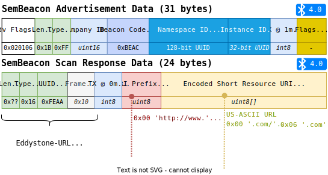

<div style="margin-left: auto; margin-right: auto; width: 80%">
    
</div>

# SemBeacon Specification

## Definition
A SemBeacon is a Bluetooth Low Energy transmitter that advertises a namespace and instance identifier and
a Uniform Resource Indicator (URI) linking to a RDF resource on the web describing the beacon's location and
other information relevant to this location.

## Bluetooth Specification

### SemBeacon Flags
The specification provisions 1-byte for flags. These flags provide more context to the installation of the beacon
so applications scanning for a beacon can decide wether or not they want to retrieve the semantic data for these beacons.

| **Bit (MSB)**  | **Description** | **Example** |
|---|---|---|
| 0 | Indicates if the beacon has a position. | 0 = Unsure, 1 = Yes |
| 1 | Indicates if the beacon is private. | 0 = Public, 1 = Private |
| 2 | Indicates if the beacon is attached to a moving object. | 0 = No, 1 = Yes |
| 3 | Indicates if the beacon has a positioning system. | 0 = No, 1 = Yes |
| 4 | Indicates if the beacon has telemetry data. | 0 = No, 1 = Yes |
| 5 - 7 | *Reserved for future use.* ||

### Resource URI
The resource URI should resolve to a semantic description of the beacon. Depending on the BLE version this resource URI
needs to be shortened to fit in the advertisement data.

#### URI Shorteners
- tinyurl.com
- bitly.com
- s.sembeacon.org (only via the SemBeacon app)

## BLE 4.x Specification


## BLE 5.x Specification


## Linked Data Vocabulary
The full documentation can be found [here](https://sembeacon.org/terms/1.0/). The preferred prefix is `sembeacon` and the preferred URI is `http://purl.org/sembeacon/`.

```turtle
@prefix sembeacon : <http://purl.org/sembeacon/> .
```

### Resource
The resource URI should lead to a semantic linked data document.
Example HTTP request:
`GET Accept=text/turtle;q=1.0 , text/n3;q=0.8 , application/rdf+xml;q=0.5`

#### Beacon
The resource URI can lead to an individual described beacon using the `sembeacon:SemBeacon` class. This is a `sosa:FeatureOfInterest` that is a subclass of `poso:BluetoothBeacon`.

If this beacon describes another resource, the `rdfs:seeAlso` predicate can be used to reference this resource.

#### Person
SemBeacons can be directed to broadcast a person described using `foaf:Person`, `vcard.Individual` or `schema.Person`.

### Classes

#### `sembeacon:SemBeacon`
A SemBeacon `sosa:FeatureOfInterest` that is a subclass of `poso:BluetoothBeacon`.

### Data Properties

#### `sembeacon:instanceId`
The 4-byte instance ID as hexadecimal representation using `xsd:hexBinary`. This property should be added
to a `sembeacon:SemBeacon`.

#### `sembeacon:namespaceId`
The 16-byte namespace ID as hexadecimal representation using `xsd:hexBinary`. This property should be added
to a `sembeacon:SemBeacon` or a `ssn:Deployment` if linked using the object property `sembeacon:namespace`.

#### `sembeacon:shortResourceURI`
The short resource URI as `xsd:anyURI`. This is the shortened resource URI if available.

### Object Properties

#### `sembeacon:namespace`
An optional namespace link to a deployment that has a `sembeacon:namespaceId`.

### Semantic Flags
The semantic flags specified in the advertisement data need to indicate that data is available online.

| **Bit**  | **Axiom** |
|---|---|
| 0 | `poso:hasPosition` **min** 1 `poso:AbsolutePosition` |
| 1 | N.a. |
| 2 | N.a. |
| 3 | `poso:inDeployment` **min** 1 `ssn:Deployment` |
| 4 | N.a. |
| 5 - 7 | *Reserved for future use.* |

### Vocabulary Uses

#### Hardware MAC-address should be used when possible
A hardware MAC address should be stored if possible.

## License and Usage
Copyright (C) 2022-2024 Maxim Van de Wynckel & Vrije Universiteit Brussel

Licensed under the Apache License, Version 2.0 (the "License"); you may not use this file except in compliance with the License. You may obtain a copy of the License at

https://www.apache.org/licenses/LICENSE-2.0

Unless required by applicable law or agreed to in writing, software distributed under the License is distributed on an "AS IS" BASIS, WITHOUT WARRANTIES OR CONDITIONS OF ANY KIND, either express or implied. See the License for the specific language governing permissions and limitations under the License.